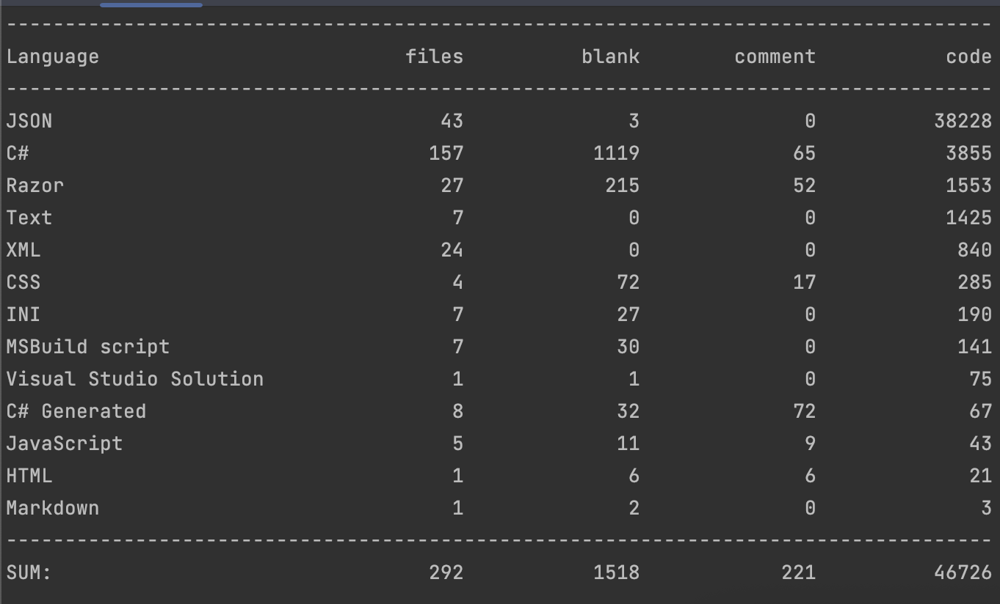
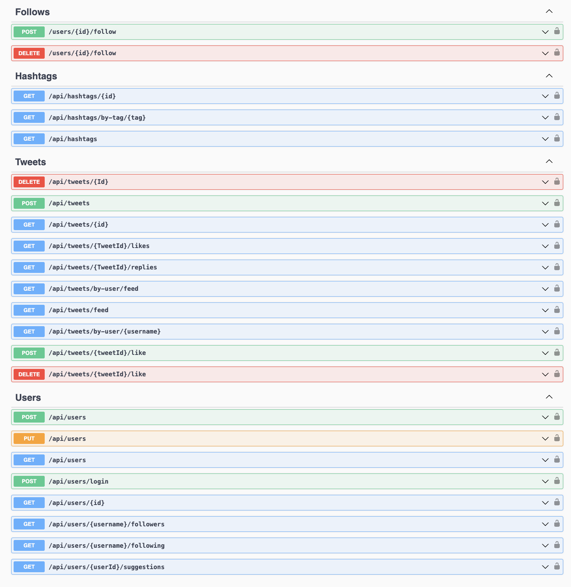
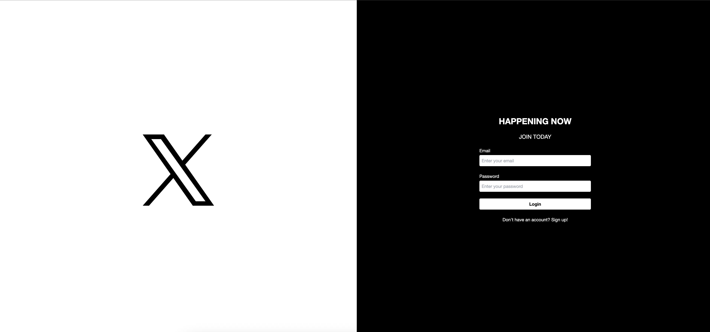
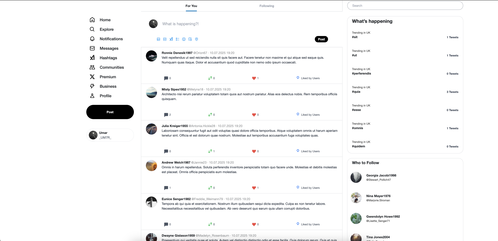
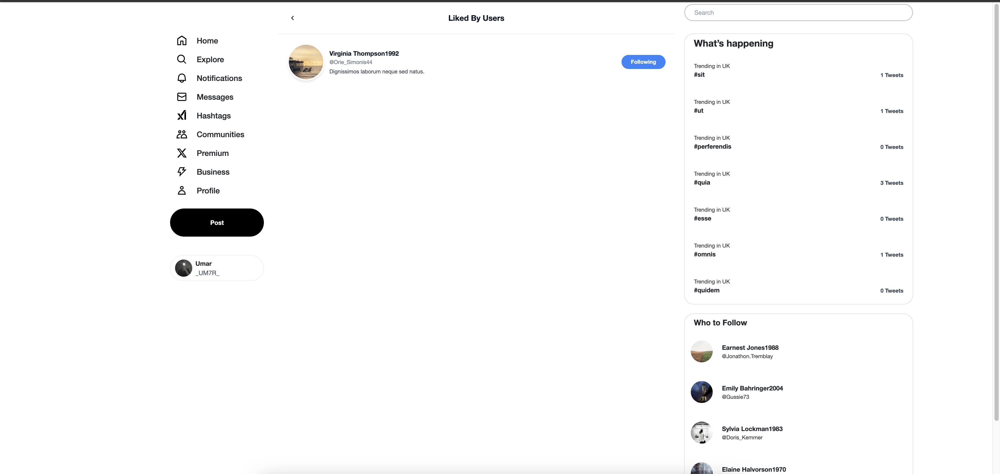
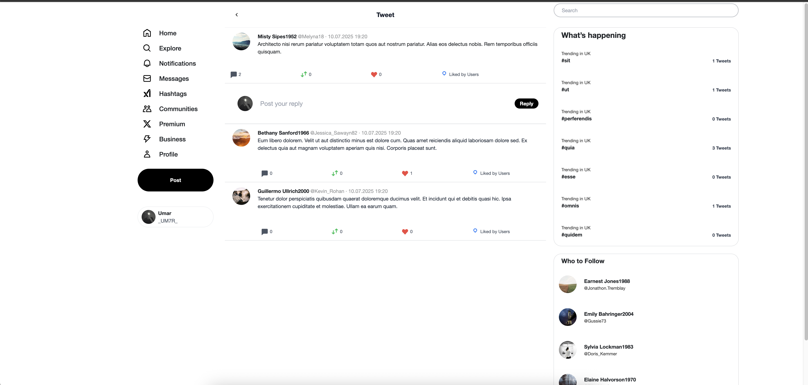
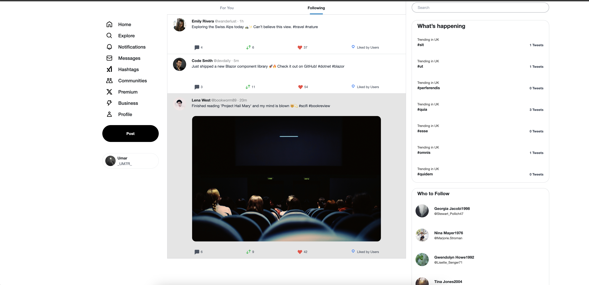
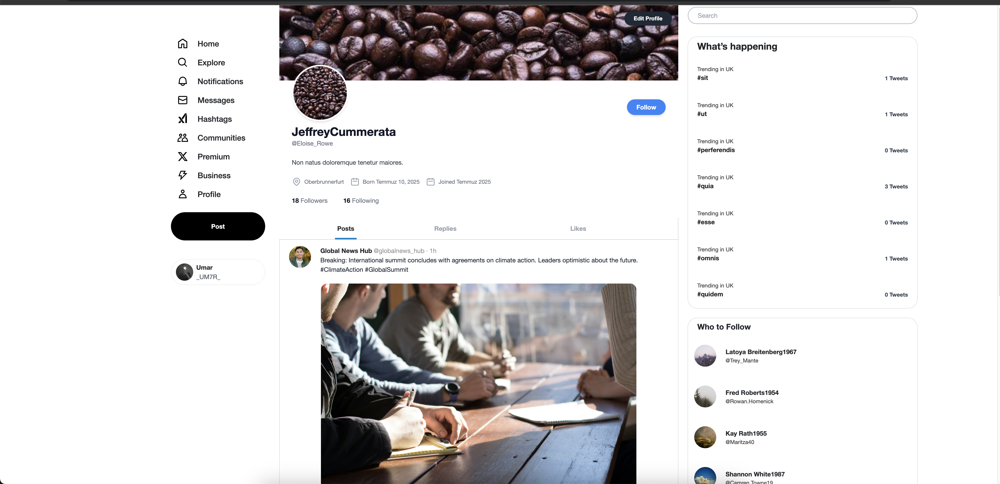
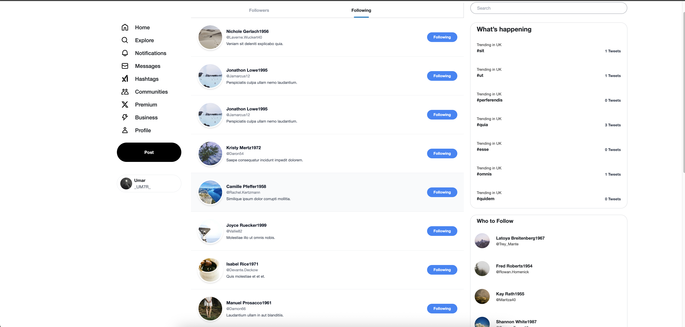
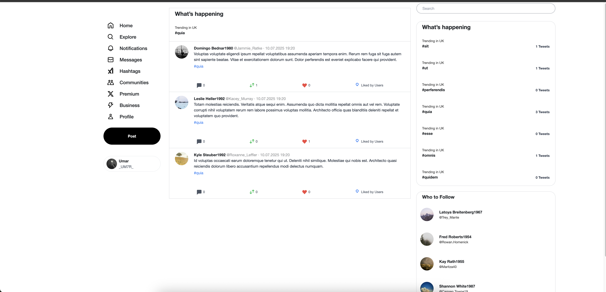

# Twitter-Clone

Twitter-Clone is a web application developed with .NET Core. On the client side, Blazor WebAssembly is used along with Tailwind CSS, while the backend Web API is designed using the Onion architecture and the CQRS design pattern. The database is built using the Entity Framework Code First approach.## Database Diagram

## 📸 Count Lines Of Code

## 📸 Web API Endpoints

## 📸 Application

## 📸 Application Screenshots

